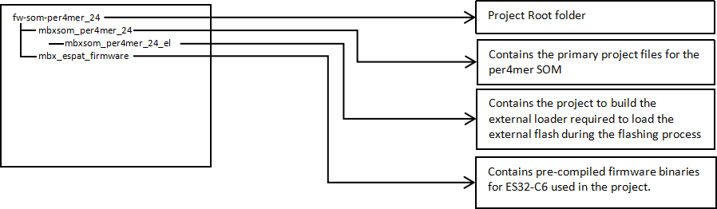
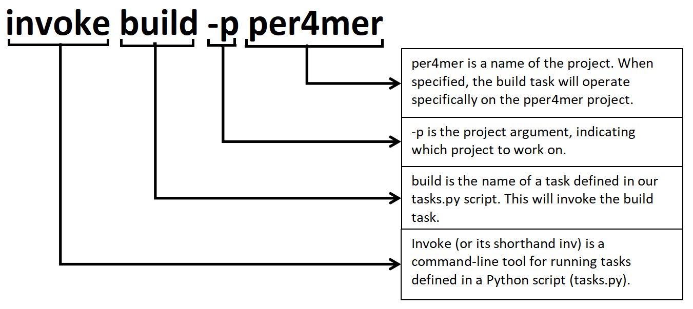

# Build the per4mer project

## Build scripts

- `Invoke framework` The Invoke Framework is a Python-based automation tool for task execution, similar to Makefiles but more flexible. It enables defining tasks as Python functions, supports CLI execution, dependency management, and parallel execution. For more details visit https://www.pyinvoke.org/
- `Make file` A Makefile is a special file used by the make build automation tool to control the build process of a project. For more detials visit https://makefiletutorial.com/

## Build scripts architecture

## Build scripts commands

| Status                              | Description                              |
|-------------------------------------|------------------------------------------|
| `invoke build -p <project_name>`    | This command compiles the specified project using the  arm-gcc toolchain |
| `invoke clean -p <project_name>`    |This command removes generated files and cleans the specified project's build directory|
| `invoke beautify -p <project_name>` |This commnad formats the specified project's code using Astyle to ensure consistent code style|
| `invoke lint -p <project_name>`     |The invoke lint commnadn runs static analysis on the specified project using cppcheck to check for coding standard violations (e.g., Misra C compliance) Note: This is not implemented yet|

#### Build scripts command explaination

## Build and setup the External Loader
- Navigate to the `fw-som-per4mer_24/fwmbxsom_per4mer_24_el` folder and run the following command “make”.

- Once the build is complete, the .stldr file will be generated inside the `fw-som-per4mer_24/mbxsom_per4mer_24_el/build`

- Now navigate to the STM32CubeProgrammer’s installation directory like the following example directory.
`C:\Program Files\STMicroelectronics\STM32Cube\STM32CubeProgrammer\bin\ExternalLoader`

- Copy or move the generated .stldr file to the STM32CubeProgrammer’s ExternalLoader directory.

## Ensure that the external loader is valid. Refer the following image

