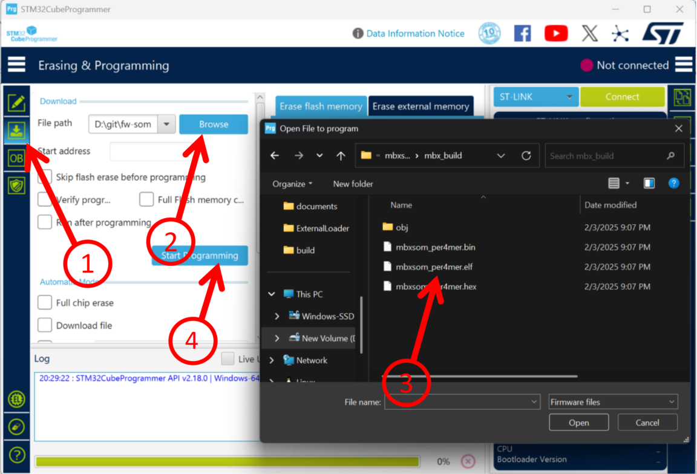
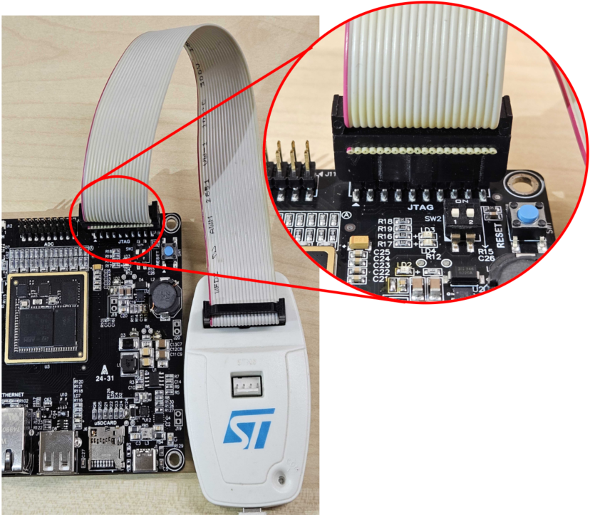
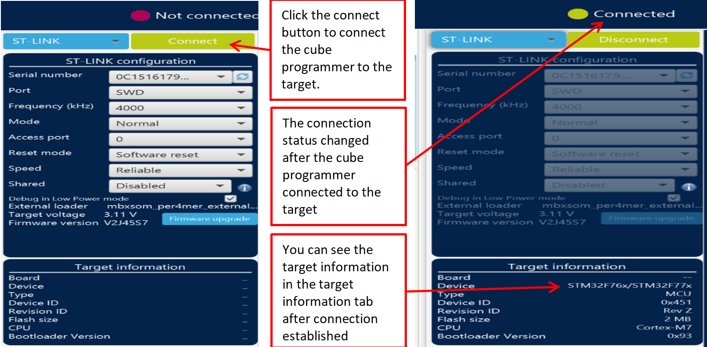
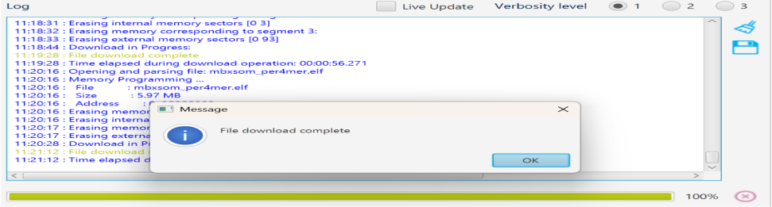
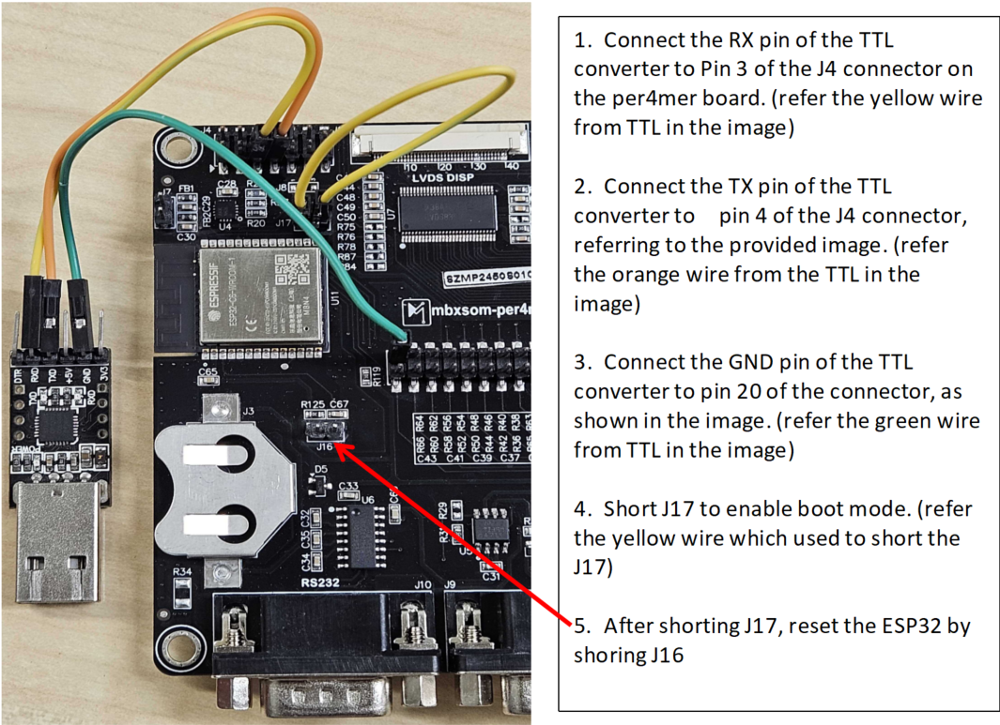
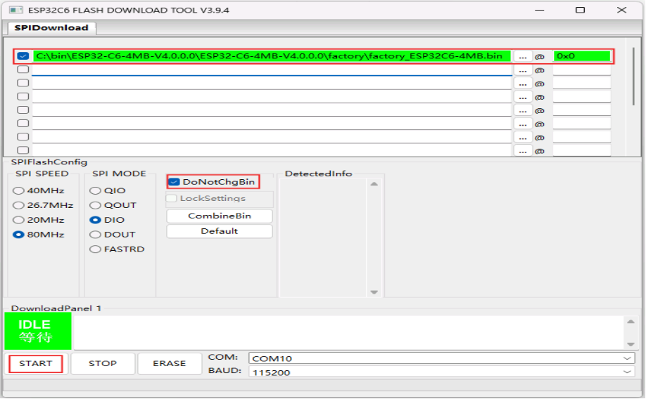

# Flashing the executable to the STM32 target

- Select the executable.

1. Click the download icon.
2. Click the browse button.
3. Navigate to the mbx_build directory and select th embxsom_per4mer.elf file.
4. Click the start programming button to start the flashing process.

## Hardware setup

1. Connect the 20-pin ST-Link connector to the JTAG-labeled header on the Per4mer board. Refer above image.
2. Ensure that the red stripe on the ribbon cable aligns with Pin 1 of the JTAG connector, indicated by an arrow mark on the board.
3. Connect and flash

4. Click Start Programming button to start the programming process.

5. Wait for the progress bar to reach 100%. Once the Flash Download Complete message appears, you can restart your Per4mer board.

---

# Flashing the ESP-AT firmware to the ESP32 target

## Setting up the hardware.

- Before starting to flash, you need to download Flash Download Tools for Windows. You can download by using this link https://www.espressif.com/en/support/download/other-tools
• Open the ESP Flash Download Tool. 
• Select chipType. Here, we select ESP32-C6. 
• Select a work-mode as Developer Mode.
• Select a load-mode as uart.

- To download one combined factory bin to address 0, select “DoNotChgBin”to use the default configuration of the factory bin. 

- In case of flashing issues, please verify what the COM port number of download interface of the ESP32-C6 board 
is and select it from “COM:” drop-down list. If you do not know the port number.