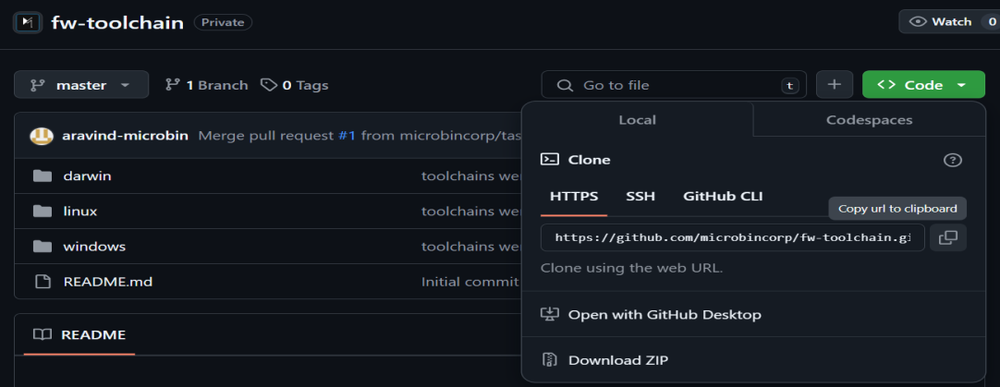
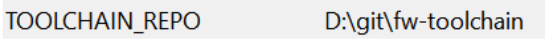

# Toolchains setup

#### Step1: Cloning the tool-chain repository:
- Navigate to the official toolchain repository by visiting the following link: https://github.com/microbincorp/fw-toolchain
- Once on the repository page, locate the “Code” button . Click on it to reveal the cloning options. Copy the HTTPS clone link: https://github.com/microbincorp/fw-toolchain.git

- Open a terminal or command prompt and navigate to the directory where you want to clone the repository. Run the following command: “git clone https://github.com/microbincorp/fw-toolchain.git”

#### Step2: Creating the environment variable:
- Add the tool chain directory as a environment variable named as `TOOLCHAIN_REPO`.

# Cloning the per4mer source code

- Navigate to the official per4mer repository by visiting the following link: https://github.com/microbincorp/fw-som-per4mer_24

- Once on the repository page, locate the “Code” button . Click on it to reveal the cloning options. Copy the SSH clone link: `git@github.com:microbincorp/fw-som-per4mer_24.git`

- Open a terminal or command prompt and navigate to the directory where you want to clone the repository. Run the following command: `git clone git@github.com:microbincorp/fw-som-per4mer_24.git`

- Once you cloned the repository you can update the sub modules by running the following command
`git submodule update --init --recursive`
