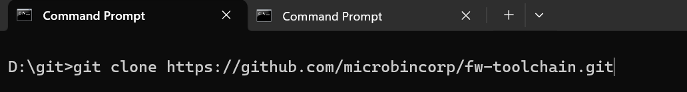
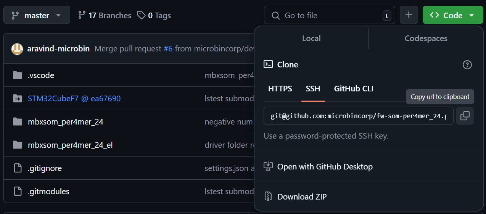
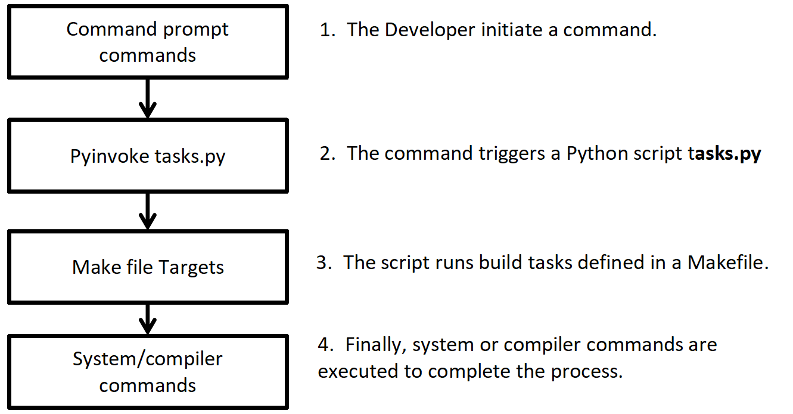
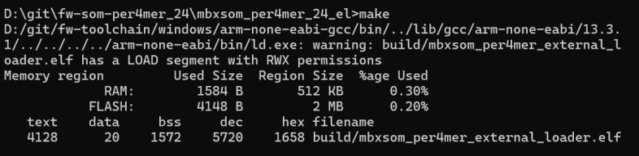
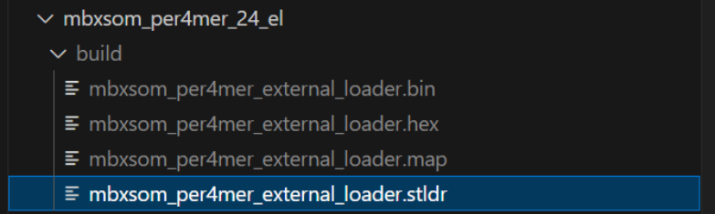
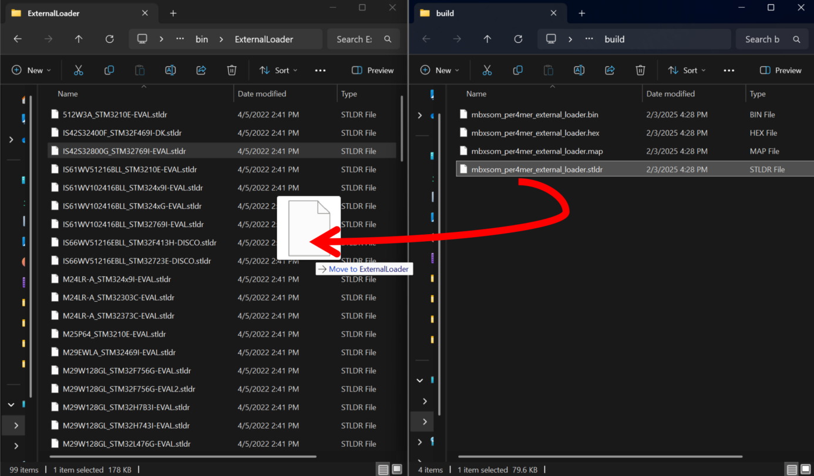
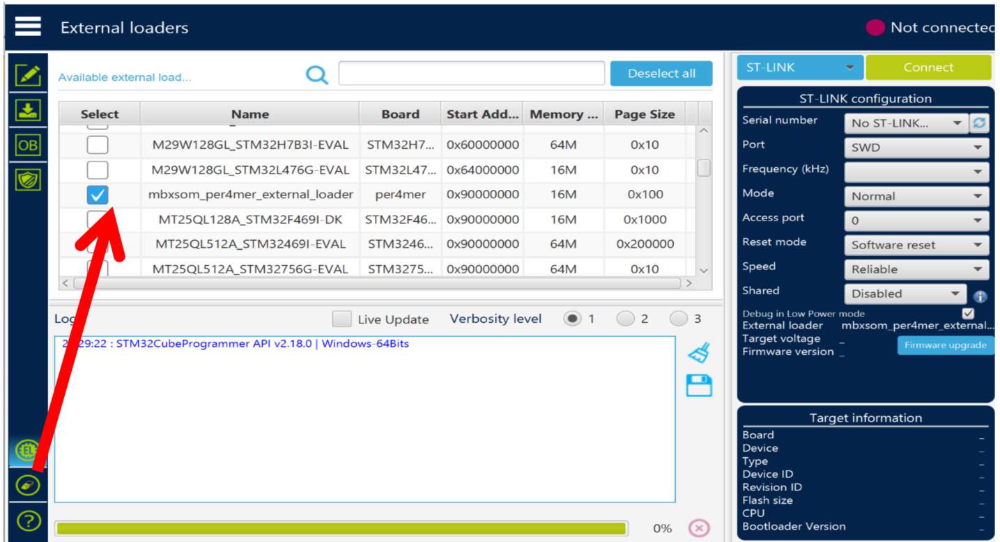
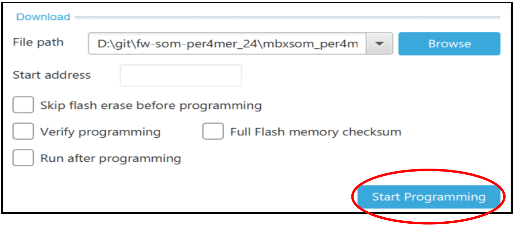
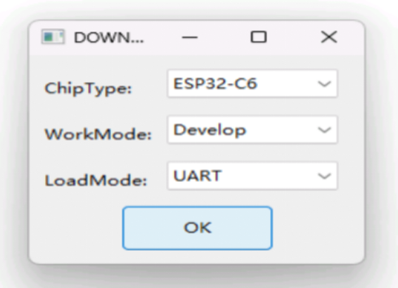

# Toolchains setup

#### Step1: Cloning the tool-chain repository:
- Navigate to the official toolchain repository by visiting the following link: https://github.com/microbincorp/fw-toolchain
- Once on the repository page, locate the “Code” button . Click on it to reveal the cloning options. Copy the HTTPS clone link: https://github.com/microbincorp/fw-toolchain.git


- Open a terminal or command prompt and navigate to the directory where you want to clone the repository. Run the following command: “git clone https://github.com/microbincorp/fw-toolchain.git”



#### Step2: Creating the environment variable:
- Add the tool chain directory as a environment variable named as `TOOLCHAIN_REPO`.


# Cloning the per4mer source code

- Navigate to the official per4mer repository by visiting the following link: https://github.com/microbincorp/fw-som-per4mer_24

- Once on the repository page, locate the “Code” button . Click on it to reveal the cloning options. Copy the SSH clone link: `git@github.com:microbincorp/fw-som-per4mer_24.git`



- Open a terminal or command prompt and navigate to the directory where you want to clone the repository. Run the following command: `git clone git@github.com:microbincorp/fw-som-per4mer_24.git`

- Once you cloned the repository you can update the sub modules by running the following command
`git submodule update --init --recursive`

# Build the per4mer project


## Build scripts

- `Invoke framework` The Invoke Framework is a Python-based automation tool for task execution, similar to Makefiles but more flexible. It enables defining tasks as Python functions, supports CLI execution, dependency management, and parallel execution. For more details visit https://www.pyinvoke.org/
- `Make file` A Makefile is a special file used by the make build automation tool to control the build process of a project. For more detials visit https://makefiletutorial.com/

## Build scripts architecture



## Build scripts commands

| Status                              | Description                              |
|-------------------------------------|------------------------------------------|
| `invoke build -p <project_name>`    | This command compiles the specified project using the  arm-gcc toolchain |
| `invoke clean -p <project_name>`    |This command removes generated files and cleans the specified project's build directory|
| `invoke beautify -p <project_name>` |This commnad formats the specified project's code using Astyle to ensure consistent code style|
| `invoke lint -p <project_name>`     |The invoke lint commnadn runs static analysis on the specified project using cppcheck to check for coding standard violations (e.g., Misra C compliance) Note: This is not implemented yet|

#### Build scripts command explaination


## Build and setup the External Loader
- Navigate to the `fw-som-per4mer_24/fwmbxsom_per4mer_24_el` folder and run the following command “make”.



- Once the build is complete, the .stldr file will be generated inside the `fw-som-per4mer_24/mbxsom_per4mer_24_el/build`


- Now navigate to the STM32CubeProgrammer’s installation directory like the following example directory.
`C:\Program Files\STMicroelectronics\STM32Cube\STM32CubeProgrammer\bin\ExternalLoader`

- Copy or move the generated .stldr file to the STM32CubeProgrammer’s ExternalLoader directory.



## Ensure that the external loader is valid. Refer the following image



## Flashing the executable to the STM32 target

- Select the executable.


1. Click the download icon.
2. Click the browse button.
3. Navigate to the mbx_build directory and select th embxsom_per4mer.elf file.
4. Click the start programming button to start the flashing process.


## Hardware setup


1. Connect the 20-pin ST-Link connector to the JTAG-labeled header on the Per4mer board. Refer above image.
2. Ensure that the red stripe on the ribbon cable aligns with Pin 1 of the JTAG connector, indicated by an arrow mark on the board.
3. Connect and flash


4. Click Start Programming button to start the programming process.



5. Wait for the progress bar to reach 100%. Once the Flash Download Complete message appears, you can restart your Per4mer board.


# Flashing the ESP-AT firmware to the ESP32 target

## Setting up the hardware.


- Before starting to flash, you need to download Flash Download Tools for Windows. You can download by using this link https://www.espressif.com/en/support/download/other-tools
• Open the ESP Flash Download Tool. 
• Select chipType. Here, we select ESP32-C6. 
• Select a work-mode as Developer Mode.
• Select a load-mode as uart.



- To download one combined factory bin to address 0, select “DoNotChgBin”to use the default configuration of the factory bin. 


- In case of flashing issues, please verify what the COM port number of download interface of the ESP32-C6 board 
is and select it from “COM:” drop-down list. If you do not know the port number.


# Per4mer folder Architecture

```
├───mbxsom_per4mer_24
│   ├───docs
│   │   └───sphinx
│   ├───mbx_app
│   │   ├───mbx_cli
│   │   ├───mbx_ethernet
│   │   ├───mbx_file_handling
│   │   ├───mbx_lvgl
│   │   │   ├───fonts
│   │   │   ├───images
│   │   │   └───screens
│   │   │       ├───adc_screen
│   │   │       ├───can_screen
│   │   │       ├───ethernet_screen
│   │   │       ├───i2c_screen
│   │   │       ├───main_screen
│   │   │       ├───rtc_screen
│   │   │       ├───sdcard_screen
│   │   │       ├───spi_screen
│   │   │       ├───uart_screen
│   │   │       └───usb_screen
│   │   ├───mbx_main
│   │   ├───mbx_stm_hal_misc
│   │   ├───mbx_test
│   │   └───mbx_threadx
│   │       └───App
│   ├───mbx_ate
│   ├───mbx_bsp
│   │   └───mbx_components
│   │       ├───level_0
│   │       │   ├───adc
│   │       │   │   └───ads131m08
│   │       │   ├───ethernet
│   │       │   │   └───lan8742
│   │       │   ├───extio
│   │       │   │   └───tca9539
│   │       │   ├───qspi
│   │       │   │   └───mt25ql128ab8e12
│   │       │   ├───sdram
│   │       │   │   └───mt48lc4m32b2
│   │       │   ├───touch
│   │       │   │   └───ili2511
│   │       │   └───wireless
│   │       │       └───esp32c6
│   │       └───level_1
│   │           ├───mbx_adc
│   │           ├───mbx_can
│   │           ├───mbx_dma
│   │           ├───mbx_dma2d
│   │           ├───mbx_fmc
│   │           ├───mbx_gpio
│   │           ├───mbx_i2c
│   │           ├───mbx_i2s
│   │           ├───mbx_interrupt
│   │           ├───mbx_ltdc
│   │           ├───mbx_qspi
│   │           ├───mbx_rtc
│   │           ├───mbx_sdmmc
│   │           ├───mbx_spi
│   │           ├───mbx_timer
│   │           ├───mbx_touch
│   │           ├───mbx_usart
│   │           ├───mbx_wdg
│   │           └───mbx_wireless
│   ├───mbx_build
│   │   └───obj
│   ├───mbx_config
│   ├───mbx_docs
│   ├───mbx_drivers
│   │   └───STM32CubeF7
│   ├───mbx_external_loader
│   │   ├───Core
│   ├───mbx_libs
│   │   └───mbx_custom_libs
│   │       └───libadc
│   │           └───obj
│   ├───mbx_middlewares
│   │   ├───level_0
│   │   │   ├───FatFs
│   │   │   ├───lvgl
│   │   │   ├───LwIP
│   │   │   ├───STM32_USB_Device_Library
│   │   │   ├───STM32_USB_Host_Library
│   │   │   └───threadx
│   │   └───level_1
│   │       ├───FATFS
│   │       ├───LWIP
│   │       ├───USB_DEVICE
│   │       └───USB_HOST
│   ├───mbx_system
│   ├───mbx_utills
│   │   └───mbx_console
│   └───sphinx
├───mbx_espat_firmware
└───per4mer_esp32_c6
```
 
# STM32 Clock Tree Configuration
## 1. Clock Sources.

| Clock sources                       | Clock source                             |
|-------------------------------------|------------------------------------------|
| HSE (High-speed External)           | 25 MHz Cristal oscillator                |
| LSE (Low-speed External)            | 32.768 KHz crystal oscillator            |
| HSI (High-Speed internal)           |16 Mhz Internal RC oscillator             |
| LSI (Low-speed internal)            | 32KHz internal RC oscillator             |

## 2. PLL Coniguration (Phase-Locked Loop)

The PLL (Phase-Locked Loop) is configured to multiply the clodk frequency to acheve high-performance system operation.

PLL Input Source:
HSE = 25MHz.
PLLM: Divider = 25. (Input clock frequency = HSE/PLLM = 25 MHz / 25 = 1 MHz)

#### PLL Dividers and Multipliers:

| Name | value |    Type    | forumula  | Output freq    |
|------|-------|------------|-----------|----------------|
| PLLN |  432  | Multiplier | PLLM*PLLN | 1*432 = 432 Mhz|
| PLLP |   2   |  Divider   | PLLN/PLLP | 432/2 = 216 Mhz|
| PLLQ |   8   |  Divider   | PLLN/PLLQ | 432/8 = 54 Mhz |

#### PLL Outputs:
Main PLL Output (SYSCLK): Drives the system clock at 216 MHz.
PLLQ Output: Configured to 54 MHz

#### PLLSAI1 Dividers and Multipliers: 
| Name    | vlaue |   Type     |  Formula	        |  Output Freq       |
|---------|-------|------------|--------------------|--------------------|
|PLLSAI1N |	192	  | Multiplier |  PLLM*PLLSAI1N	    | 1 * 192 = 192 Mhz  |
|PLLSAI1P |	4	  | Divider	   |  PLLSAI1N/PLLSAI1P | 192 / 4 = 48 Mhz   |
|PLLSAI1R|	2	  | Divider    |  PLLSAI1N/PLLSAI1R/div | 192 / 2 / 2 = 48 Mhz |

#### PLL Outputs: 
PLLSAIR Output: Configured to 48 MHz.
PLLSAIP Output: Configured to 48 MHz

PLLI2S Dividers and Multipliers: 
Name |	vlaue |	Type |	Formula |	Output Freq |
|----|--------|------|----------|---------------|
|PLLI2SN|	192|	Multiplier|	PLLM*PLLI2SN|1 * 192 = 192 Mhz|
|PLLI2SP	|2	|Divider	|PLLI2SN/PLLI2SP	|192 / 2 = 96 Mhz|
|PLLI2SR|	2|	Divider|	PLLI2SN/PLLI2SR|	192 / 2 = 96 Mhz|

#### PLL Outputs:
Main PLL Output (SYSCLK): Drives the system clock at 216 MHz.
PLLQ Output: Configured to 54 MHz

## 3.System Clock (SYSCLK) Source
PLLCLK (output of the main PLL). Frequency: 216 MHz.

## 4.Bus Clocks source from SYSCLK (216 MHz)
|BUS Name |	Prescaller|	Multiplier|	Freq |
|---------|-----------|-----------|------|
|AHB (HCLK)	|1	|NA	|216 MHz|
|APB1 Peripherals clocks|	4|	NA|	54 MHz|
|APB2 Peripherals clocks	|2	|NA	|108 MHz|
|APB1 Timer clocks|	4|	2|	108 MHz|
|APB2 Timer clocks	|2	|2	|216 MHz|

## 5.Peripheral Clock Configuration.
|Peripheral Name|	Clock IN|	Prescaller|	Freq|	Enabled|
|---------------|-----------|-------------|-----|----------|
|SPI1	|APB2	|16	|108/16 = 6 MHz	|✓|
|SPI2	|APB1	|-|	54 MHz|	
|SPI3	|APB1	|-|	54 MHz|	
|SPI4	|APB2	|8|	108/8 = 13 MHz|	✓|
|SPI5	|APB2	|32	|108/8 = 3 MHz	|✓|
|SPI6	|APB2	|16	|108/16 = 6 MHz	|✓|
|I2C1	|APB1	|required baud-rate|	54 MHz|	✓|
|I2C2	|APB1	|required baud-rate|	54 MHz|	✓|
|I2C3	|APB1	|-|	54 MHz|	
|I2C4	|APB1	|-|	54 MHz|	
|USART1	|APB2	|-|	108 MHz|	
|USART2	|APB1	|required baud-rate	54 MHz|	✓|
|USART3	|APB1	|-|	54 MHz|	
|UART4	|APB1	|-|	54 MHz|	
|UART5	|APB1	|-|	54 MHz|	
|USART6	|APB2	|required baud-rate	|108 MHz|	✓|
|UART7	|APB1	|-|	54 MHz|	
|UART8|	APB1|	-|	54 MHz|	
|CAN1|	APB1|	-|	54 MHz|	
|CAN2|	APB1|	-|	54 MHz|	
|CAN3|	APB1|	12|	4 MHz|	✓|
|SDMMC1|	PLL48CLK|	48|	1 MHz|	✓|
|SDMMC2|	APB2|	-|	108 MHz|
|LTDC|	PLLSAI1R|	-|	48 MHz|	✓|
|Ethernet PTP|	HCLK|	-|	216 MHz|	✓|
|USB|	PLLSAIP|	-|	48 MHz|	✓|
|I2S1|	PLLI2SR|	-|	96 MHz|
|I2S2|	PLLI2SR|	-|	96 MHz|	✓|
|I2S3|	PLLI2SR|	-|	96 MHz|	
|FMC|	AHB	2|	108 MHz|	✓|